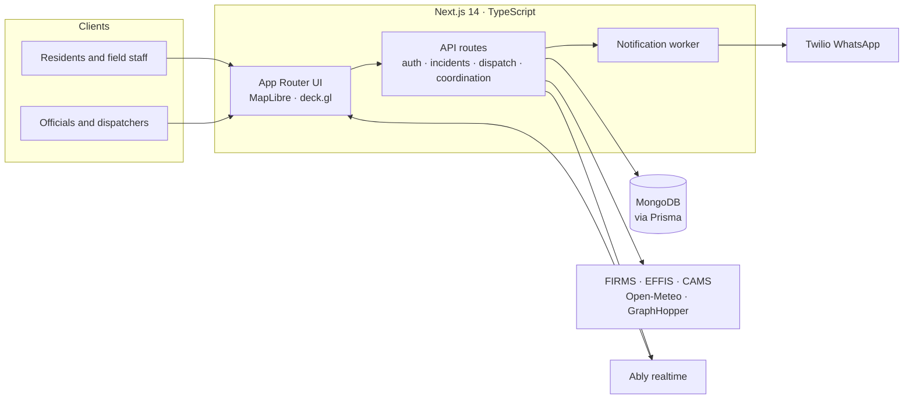

<p align="center">
  
</p>

<p align="center">
  <a href="https://github.com/MTC-123/capestone-final/actions/workflows/ci.yml"></a>
  
  
  <a href="LICENSE"></a>
</p>

<p align="center">
  <a href="https://ricer-project.vercel.app/signin"><b>Live demo</b></a> &nbsp;·&nbsp;
  <a href="apps/web/docs/ARCHITECTURE.md">Architecture</a> &nbsp;·&nbsp;
  <a href="apps/web/docs/API.md">API</a> &nbsp;·&nbsp;
  <a href="docs/README.md">Documentation</a>
</p>

---

**RICER** (Resilient Infrastructures and Coordinated Emergency Response) is a web platform for forest-fire response in Ifrane Province, Morocco. It connects reports from residents and field staff with the officials who assess incidents, assign vehicles and teams, and coordinate across agencies, all on one shared record.

It is being developed as a Computer Science capstone at Al Akhawayn University in Ifrane, supervised by Houda Chakiri.

## Why

When a fire is reported, responders need its location, the evidence, available resources and the current response status in one place. Today those pieces sit in phone calls, device photos, paper forms and regional bulletins. RICER keeps the report, the dispatch decision and the response status in a single record that each authorised agency can see.

## Capabilities

<table>
<tr>
<th align="left" width="50%">What it does</th>
<th align="left" width="50%">How it holds up</th>
</tr>
<tr valign="top">
<td>

- **Fire reporting**: map-based reports from residents and field staff
- **Common operating picture**: incidents, vehicles, infrastructure and environmental layers on one MapLibre map
- **Dispatch**: routed assignments, isochrones and nearest-team lookup
- **Multi-agency coordination**: ICS roles, mutual-aid requests, communication logs
- **Operations**: campaign checklists, debriefings, equipment and retardant inventory
- **Fire records**: verification, approval, perimeters, NASA FIRMS import, PDF export

</td>
<td>

- **Role-based access control**: JWT sessions, server-side permissions for civilians and officials
- **Attribution**: records note who created or changed them; per-incident communication logs
- **Graceful degradation**: external data sources fail visibly, not silently
- **Trilingual**: Arabic (right-to-left), French and English
- **Observability**: structured errors, health endpoint, Sentry
- **Tested**: 1,675 unit and integration tests, plus Playwright end-to-end suites

</td>
</tr>
</table>

## Architecture



See [ARCHITECTURE.md](apps/web/docs/ARCHITECTURE.md) and the [architecture decision records](apps/web/docs/adr) for detail.

## Quick start

Requires Node 20 and a MongoDB instance.

```bash
git clone https://github.com/MTC-123/capestone-final.git
cd capestone-final/apps/web
cp .env.example .env.local   # then fill in DATABASE_URL and JWT_SECRET
npm ci && npx prisma db push
npm run dev                  # http://localhost:3000
```

| Command | Purpose |
|---|---|
| `npm run test:unit` | Unit and integration tests (Vitest) |
| `npm run test:e2e` | End-to-end tests (Playwright) |
| `npm run lint` · `npm run typecheck` | Static checks |
| `npm run worker:start` | Background notification worker |

Deployment: the live demo runs on Vercel ([installation guide](apps/web/INSTALLATION.md)). A multi-stage [Dockerfile](Dockerfile), a [Railway config](railway.toml) and a [Helm chart](apps/web/helm/ricer-web) are included for container hosting.

## Repository layout

```
.
├── apps/web/          Next.js application: source, tests, Prisma schema, Helm chart, OpenAPI spec
├── data/gis/          GIS source layers for Ifrane Province
├── scripts/gis/       GIS preparation scripts
├── docs/              Specifications, dispatch guides, audits, research, roadmap
└── .github/           CI workflow, issue and pull-request templates
```

## Roadmap

The capstone (September to December 2026) extends the platform with:

- **Offline-first field reporting**: IndexedDB queue and service worker, with idempotent sync so retries never create duplicates
- **Model-backed risk layer**: the partner team's XGBoost wildfire-occurrence model served with version and data time, replacing the current weather-based heuristic
- **Operational hardening**: rehearsed backup restore, load tests at 10 / 25 / 50 concurrent users, email as a third notification channel

## Contributing and security

See [CONTRIBUTING.md](CONTRIBUTING.md). Report vulnerabilities privately as described in [SECURITY.md](SECURITY.md), not in public issues.

## Acknowledgements

Al Akhawayn University in Ifrane, School of Science and Engineering. Supervisor: Houda Chakiri. The wildfire-occurrence model is the work of the RICER machine-learning team (M. Erraisse, R. Souane, W. Hara). Environmental data from NASA FIRMS, Copernicus EFFIS and CAMS, and Open-Meteo.

## License

[MIT](LICENSE)
